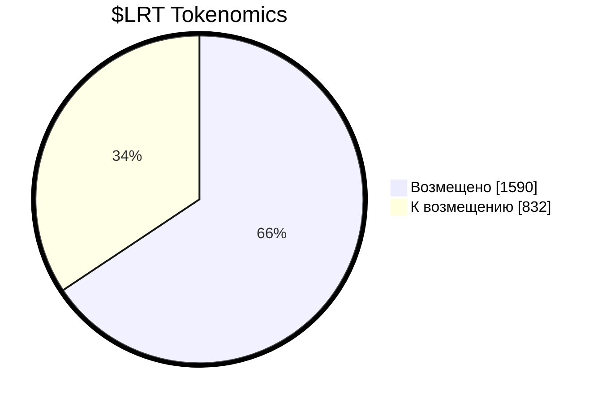

## Токеномика Lombard Revival Token ($LRT)
$LRT — облигационный токен Ломбарда, который в определённый срок можно будет обменять 1:1 на токен проекта Кредитон $KRDT (а можно и не обменять).
#### Total supply: 2’422 $LRT
#### Ownership is revoked

